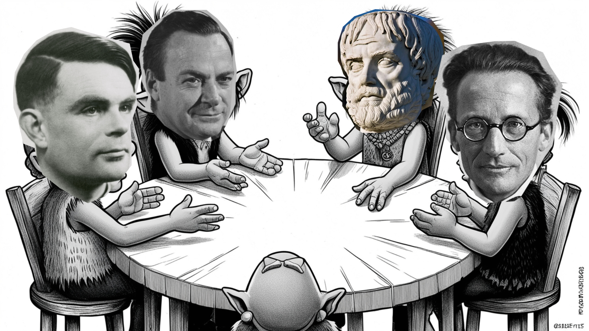

# TinyTroupe AI Symposium Simulation

I tested out Microsoft's [TinyTroupe](https://github.com/microsoft/TinyTroupe/tree/main) library to simulate some of the world renowned thinkers to sit around a table and discuss if we can achieve Artificial Consciousness in the future. 

The figures include: 
- Richard Feynman
- Aristotle
- Erwin Schrodinger 
- Alan Turing

To work with the TinyTroupe framework check out their github page and follow the documentation. The `config.ini` file is the configuration i used for my test. Feel free to use the default config or just change it.

# **⚠️ Disclaimer**
the notebook will probably not run without some debugging. I created it inside the clone of the repository locally and this is a last-minute github push. also this is test-purposed so best-practices are out the window. you can however check out each person's conversation and also create your own tests by simply changing the code. 